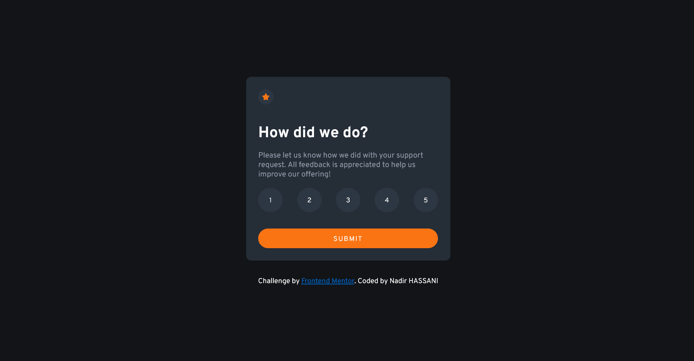

# Frontend Mentor - Interactive rating component solution

This is a solution to the [Interactive rating component challenge on Frontend Mentor](https://www.frontendmentor.io/challenges/interactive-rating-component-koxpeBUmI). Frontend Mentor challenges help you improve your coding skills by building realistic projects. 

## Table of contents

- [Overview](#overview)
  - [The challenge](#the-challenge)
  - [Screenshot](#screenshot)
  - [Links](#links)
- [My process](#my-process)
  - [Built with](#built-with)
  - [What I learned](#what-i-learned)
  - [Continued development](#continued-development)
  - [Useful resources](#useful-resources)
- [Author](#author)
- [Acknowledgments](#acknowledgments)

**Note: Delete this note and update the table of contents based on what sections you keep.**

## Overview

### The challenge

Users should be able to:

- View the optimal layout for the app depending on their device's screen size
- See hover states for all interactive elements on the page
- Select and submit a number rating
- See the "Thank you" card state after submitting a rating

### Screenshot




### What I learned

Connect button values to the thank you paragraph and display their values using JavaScript.
```


### Useful resources

- [Example resource 1](https://www.youtube.com/watch?v=cQnUopEeZgw&ab_channel=TsbSankara) - This helped me to get a hint on how to display the values of the buttons.


## Author
- Frontend Mentor - [@nadrsturk](https://www.frontendmentor.io/profile/nadrsturk)
- Twitter - [@Nadrsturk](https://twitter.com/Nadrsturk)